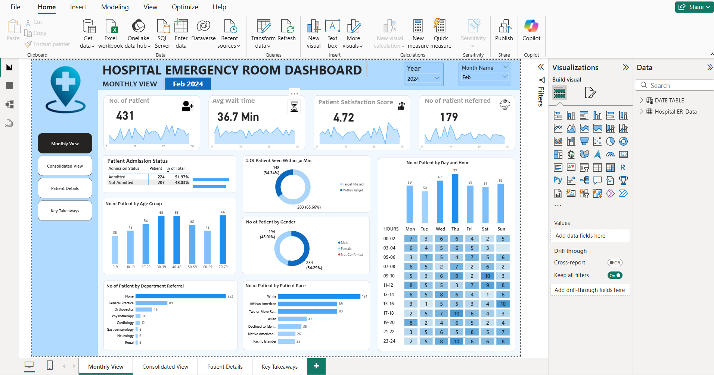

# 🏥 Hospital Emergency Room Dashboard | Power BI

## 📌 Project Overview
Developed an interactive Power BI dashboard using **9,216 hospital emergency room records** to analyze patient admissions, waiting times, satisfaction scores, referrals, and demographics. The project involved data cleaning with Power Query, DAX measure creation, data modeling, and dashboard development to transform raw healthcare data into actionable business insights for operational decision-making.

---

## 🎯 Business Problem
Hospitals generate thousands of patient records every month, making it difficult to monitor emergency room performance through raw data alone. This dashboard provides healthcare administrators with a centralized view of key performance indicators, enabling them to identify operational bottlenecks, monitor patient flow, and improve service quality.

---

## 📊 Dashboard Highlights
- Executive KPI Dashboard
- Patient Admission Analysis
- Average Waiting Time Tracking
- Patient Satisfaction Monitoring
- Admission Status Breakdown
- Department Referral Analysis
- Age, Gender & Race Distribution
- Monthly Patient Trends
- Interactive Filters & Slicers

---

## 🛠️ Tools & Technologies
- Power BI
- Power Query
- DAX
- Microsoft Excel
- Data Modeling
- Data Visualization

---

## 📈 Key Performance Indicators (KPIs)
- Total Patients
- Average Waiting Time
- Patient Satisfaction Score
- Admission vs Non-Admission Rate
- Department Referrals
- Monthly Patient Trends

---

## 📸 Dashboard Preview

### Executive Overview
Provides a high-level summary of emergency room performance, including total patients, waiting time, patient satisfaction, admission status, and monthly trends.

---

### Patient Demographics
Analyzes patient distribution by age, gender, race, and attendance patterns to identify demographic trends and healthcare demand.

---

### Operational Insights
Displays department referrals, admission outcomes, and waiting time analysis to support efficient emergency room operations.

---

## 📂 Dataset
The project uses a hospital emergency room dataset containing **9,216 patient records**. The dataset includes patient demographics, admission details, waiting times, satisfaction scores, referral departments, and visit information, serving as the foundation for data transformation, analysis, and visualization.

---

## 💼 Skills Demonstrated
- Data Cleaning
- Data Transformation
- Data Modeling
- DAX Calculations
- KPI Development
- Dashboard Design
- Business Intelligence
- Healthcare Analytics
- Interactive Data Visualization

---

## 🚀 Project Outcome
This dashboard transforms raw hospital data into meaningful insights that enable healthcare professionals to monitor emergency room performance, identify trends, optimize resource allocation, reduce patient waiting times, and support informed, data-driven decision-making.

---

⭐ If you found this project useful, feel free to explore the repository and provide your feedback!# Hospital-Emergency-Room-Dashboard-Power-BI
Developed an interactive Power BI dashboard using 9,216 hospital emergency room records to analyze patient admissions, waiting times, satisfaction scores, referrals, and demographics. Performed data cleaning with Power Query, created DAX measures, and built dynamic visualizations to support data-driven healthcare decisions.
